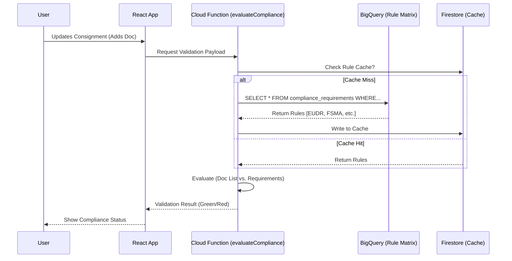

# Technical Design: Advanced Compliance Engine (BigQuery Integrated)

**Status**: [Phase 2 Design]
**Owner**: VeriPura Connect
**Date**: 2026-01-11

## 1. Objective

Establish Google BigQuery as the authoritative "Source of Truth" for complex regulatory trade rules. Move away from hardcoded client-side rules or generic AI guesses to deterministic, audit-traceable rule executions.

## 2. Architecture Overview

### Rule Definition (The "Golden Source")

* **Database**: BigQuery (Dataset: `veripura_compliance_rules`)
* **Table**: `compliance_requirements` (See `docs/BIGQUERY_SCHEMA.md`)
* **Content**: Granular mapping of `Origin` + `Destination` + `HS Code` -> `Required Documents` + `Specific Regulations`.

### Rule Execution (The "Runtime")

1. **Frontend (React)**:
    * **Triggers** "Check Compliance" when user modifies Consignment details.
    * **Calls** Firebase Cloud Function `evaluateCompliance`.

2. **Backend (Cloud Function)**:
    * **Input**: `{ origin, destination, hsCodes[], attributes[], documents[] }`
    * **Logic**:
        1. Constructs SQL query for BigQuery.
        2. Query selects rules matching `hs_code_prefix`, `origin`, `destination`.
        3. Returns list of *applicable rules* and *missing requirements*.
    * **Caching**: Function caches frequently used rule sets (e.g., Vietnam -> EU Coffee) in Firestore/Redis to minimize BigQuery costs/latency.

3. **Auditing**:
    * Every check is logged to `veripura_audit_logs.consignment_validations` in BigQuery for later analysis.

## 3. Data Flow

## 4. Implementation Steps (Planned)

1. **BigQuery Setup** (Done): Schema defined.
2. **Cloud Function**: Create `functions/src/compliance/evaluate.ts`.
3. **Client Integration**: Update `complianceService.ts` to call this new function.
4. **Admin Tooling**: Create method to specific rules into BigQuery (e.g., uploading CSVs of regulations).
