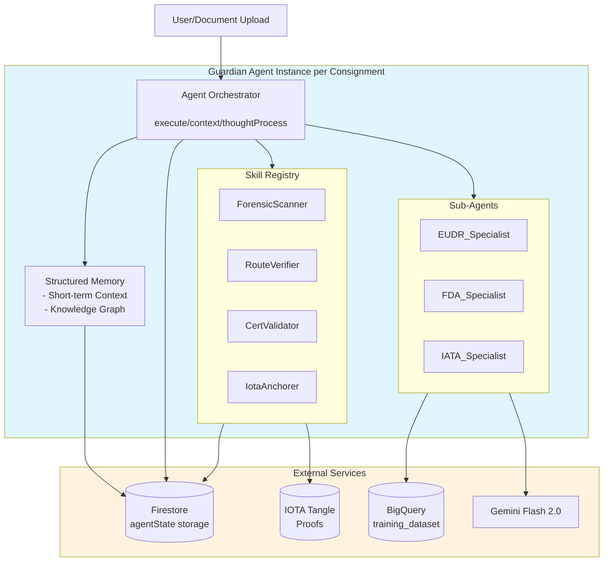

# Guardian Agent Architecture Implementation Plan

## Overview

This document provides a comprehensive implementation plan for the **Guardian Agent Architecture** described in [`bizlogic.md`](file:///Users/onno/veripura-core-final/bizlogic.md). The current codebase has basic agent functionality, but we are moving towards a "One Consignment, One Agent" architecture with structured memory, skills, and RAG capabilities.

**Important:** This implementation is designed to be **non-breaking**. The existing codebase will continue working while the new Guardian Agent system is added alongside it.

---

## 1. System Architecture



---

## 2. Non-Breaking Integration Strategy

### Key Design Principles

1. **Side-by-Side Operation**: New Guardian Agent runs in parallel with existing logic.
2. **Optional Activation**: Use environment variable `VITE_ENABLE_GUARDIAN_AGENT` to control rollout.
3. **Graceful Fallback**: If Guardian Agent fails, system falls back to existing implementation.
4. **No Schema Breaking Changes**: New fields are additive only (e.g., `guardianAgent` in the consignment document).

---

## 3. Data Models & Types (Additive)

### 3.1 Enhanced Consignment with Agent State

We use the updated definitions in [`types.ts`](file:///Users/onno/veripura-core-final/types.ts):

* **`AgentState`**: Manages memory, skills, sub-agents, and session history.
* **`AgentMemory`**: Contains short-term context (thoughts, pending decisions) and long-term Knowledge Graph (facts, relationships).
* **`ConsignmentWithGuardianAgent`**: Extends the base consignment with the `guardianAgent` state.

---

## 4. Implementation Specifications

### 4.1 Guardian Agent Core Service

**File:** `services/agent/guardianAgent.ts`

The core service handles the lifecycle of the agent:

* **Hydration**: Loading state from Firestore.
* **Process Event**: Executing skills and sub-agents based on triggers (Upload, Decision, etc.).
* **Dehydration**: Persisting state back to Firestore.

### 4.2 RAG Context Building

The agent uses similarity matching against the `training_dataset` to inform its decisions.

```typescript
// Logic from RAGContextBuilder
private calculateContextConfidence(cases: SimilarCase[], regulations: Regulation[]): number {
  // Confidence based on number and quality of similar cases
  const caseConfidence = Math.min(cases.length * 0.2, 0.8);
  const regulationConfidence = regulations.length > 0 ? 0.2 : 0;
  return Math.min(caseConfidence + regulationConfidence, 1.0);
}
```

---

## 5. Firestore Schema Updates

### 5.1 New Collections

* **`guardian_agents`**: (Subcollection under consignments) Stores the agent's full state.
* **`training_dataset`**: (Existing) Enhanced with `featureVector` (embeddings) and `humanReview` (Golden Labels).
* **`agent_sessions`**: Metrics tracking for performance monitoring.

### 5.2 Firestore Rules Update

Update [`firestore.rules`](file:///Users/onno/veripura-core-final/firestore.rules) to secure agent data:

```javascript
match /consignments/{consignmentId} {
  // ... existing rules ...
  match /guardian_agent/{document=**} {
    allow read, write: if request.auth != null && 
      get(/databases/$(database)/documents/consignments/$(consignmentId)).data.ownerId == request.auth.uid;
  }
}
```

---

## 6. Integration Points

### 6.1 Consignment Creation (Guardian Agent Spawn)

Modify [`consignmentService.ts`](file:///Users/onno/veripura-core-final/services/consignmentService.ts):

```typescript
// 1. Spawn Guardian Agent (NEW)
try {
  const { guardianAgentFactory } = await import('../agent/guardianAgent');
  const agent = await guardianAgentFactory.spawn(internalId);
  
  // 2. Generate initial roadmap using agent
  const roadmap = await agent.generateInitialRoadmap({
    origin: data.exportFrom,
    destination: data.importTo,
    products: data.products
  });
  
  await updateDoc(docRef, { roadmap, 'guardianAgent.status': 'idle' });
} catch (agentError) {
  console.error('[ConsignmentService] Guardian Agent spawn failed:', agentError);
}
```

### 6.2 Document Upload (Guardian Process Event)

```typescript
// 1. Hydrate Guardian Agent
const agent = await guardianAgentFactory.spawn(consignmentId);

// 2. Process document upload event
const eventResult = await agent.processEvent({
  type: 'DOCUMENT_UPLOAD',
  payload: { docType, analysisResult, documentHash, iotaTxHash }
});

// 3. Use agent's insights for flagging decisions
const shouldFlag = eventResult.alerts.some(a => a.severity === 'critical');
```

---

## 7. Frontend Integration

### 7.1 Agent State Display Component

**New File:** `components/compliance/GuardianAgentPanel.tsx`

Provides a UI for:

* **Thoughts**: Real-time visualization of the agent's logic.
* **Facts**: View the extracted knowledge for the consignment.
* **Skills**: See which capabilities were used.

---

## 8. Summary & Next Steps

This plan provides a safe, non-breaking path to implement the Guardian Agent Architecture.

1. **Phase 1**: Finalize `types.ts` (Done).
2. **Phase 2**: Implement `GuardianAgent` core service.
3. **Phase 3**: Connect `consignmentService` hooks.
4. **Phase 4**: Build the frontend `GuardianAgentPanel`.
